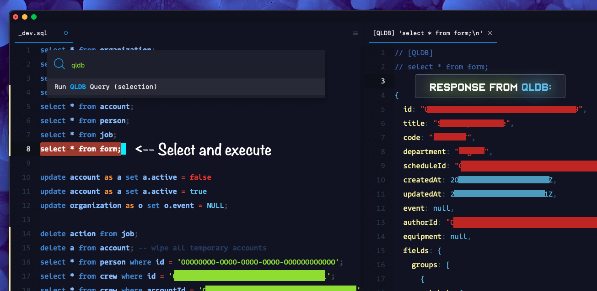
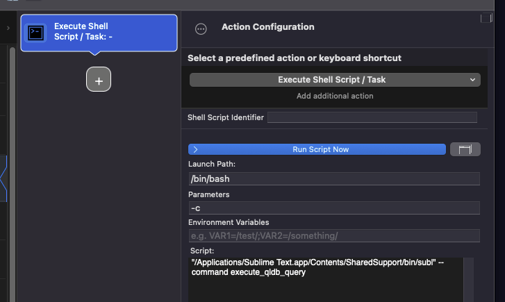

## THE MISSING QLDB Client for Sublime Text

> [!WARNING]  
> - For dev/test environment use only.
> - It allows you to run ANY currently selected text as an actual database query.
> - Against your current authenticated AWS profile
> -
> - [ WITHOUT CONFIRMATION ]

1. Select command.
2. Run it.
3. Results show up in a side panel.



#### Prerequisites:
- QLDB Shell
```bash
brew tap aws/tap # Add AWS as a Homebrew tap
brew install qldbshell
```
- Valid AWS Credentials (this plugin doesn't provide a way to log in to AWS, it assumes you're already authenticated with a valid profile and sufficient permissions.)

Sample `ion.conf` in project root:
```ion
sample 
{
  default_ledger: "DEVORTESTLEDGERNAME",
  region: "region-name-1",
  ui: {
    auto_commit: true,
    prompt: "⚛$LEDGER⚛$REGION⚛$ACTIVE_TRANSACTION ",
    format: "table",
    edit_mode: "Vi",
    display_welcome: false,
    display_ctrl_signals: false,
    display_query_metrics: false,
    terminator_required: false  
  }
}
```

## Installation instructions:
- This plugin has no safeguards to protect you from damaging your database if you accidentally run the wrong query.
- If you know what you're doing, you also already know how to install it. 

<br/><br/>
## Quantum Ledger Blockchain<br/>Crypto Database admin workflow<br/><br/> ...with DJ Controllers?
> [!WARNING]  
> - It will try to run whatever active selection as a real query.
> - WITHOUT CONFIRMATION!
> - Seriously. Do not drop your prod tables.

Map this command to a MIDI controller:
```bash
"/Applications/Sublime Text.app/Contents/SharedSupport/bin/subl" --command execute_qldb_query
```


> screenshot from BetterTouchTool

You can map another button to bring up your `common-queries.sql` file with frequently needed commands so you don't have to manually type them in and accidentally drop your tables again.

And set a filter for BetterTouchTool to only allow triggering this shortcut if ST has your project actively open in the foreground with the cursor in the that file.


## TODOS:
- [ ] Actually respect ion.config values, currently you'll need them __hardcoded in plugin.py__
- [ ] Support for multiple selections - running multiple queries does work but only if it's a single continuous selection.
- [ ] Migrate to immudb before AWS kills off QLDB in a few months 🤷‍♂️